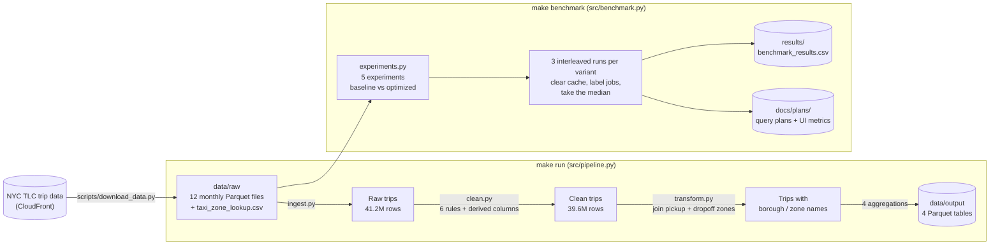

# nyc-taxi-spark-performance

[](https://github.com/Lakshna15/nyc-taxi-spark-performance/actions/workflows/ci.yml)

A PySpark pipeline that cleans and analyzes a full year of NYC yellow taxi trips (2024, 41.2
million rows). It then measures, with real benchmarks, how five common Spark optimizations
change its performance.

I built this while moving from backend engineering (Python, SQL, Node.js, PostgreSQL) into
data engineering. Here's what I learned. Spark's lazy evaluation means a pipeline is a *plan*
until an action runs it, and reading the physical plan (`explain()`) is the fastest way to
see what Spark will actually do. Some optimizations are big wins: Parquet instead of CSV was
**12x faster**, and broadcasting a small lookup table instead of shuffling 40M rows was
**3.8x faster**. Others barely mattered at this scale: shuffle-partition tuning made no
measurable difference, and partition pruning saved 11x the bytes read but little time on
a single month. One "optimization" made things worse: caching was **29% slower**, because
rebuilding cheap Parquet reads cost less than filling a 1.8 GB cache. The lesson is to
measure instead of assuming.

## Results

Median of 3 runs per variant, from [`results/benchmark_results.csv`](results/benchmark_results.csv)
(generated with `make results-table`). Full plans and Spark UI metrics: [`docs/plans/`](docs/plans/).
Detailed write-up: [`docs/experiments.md`](docs/experiments.md).

| Experiment | Variant | Baseline (s) | This variant (s) | Speedup |
|---|---|---:|---:|---:|
| file_format | optimized | 5.71 | 0.47 | 12.15x |
| partition_pruning | optimized | 0.32 | 0.25 | 1.28x |
| broadcast_join | optimized | 8.02 | 2.14 | 3.75x |
| shuffle_partitions | optimized | 6.60 | 6.43 | 1.03x |
| shuffle_partitions | aqe_on | 6.60 | 6.75 | 0.98x |
| caching | optimized | 16.49 | 21.23 | 0.78x |

| Experiment | Baseline | Optimized |
|---|---|---|
| file_format | Read a CSV copy of the data (4.47 GB) | Read the original Parquet (0.69 GB) |
| partition_pruning | Query June from a flat folder of Parquet files | Query June from data partitioned by year/month |
| broadcast_join | Join to zones with auto-broadcast disabled (sort-merge join) | Same, with an explicit `broadcast()` hint |
| shuffle_partitions | 200 shuffle partitions, AQE off | 14 partitions (= cores), AQE off; plus `aqe_on`: 200 partitions with AQE on |
| caching | 4 aggregations, each recomputing from Parquet | `.cache()` the shared input, then the same 4 aggregations |

### Why it got faster (or didn't)

- **File format, 12x faster.** CSV is plain text: to get two columns, Spark had to read and
  parse all 4.2 GB, every character of every line. Parquet stores each column separately
  and compressed, so Spark read only the two columns the query used.
- **Partition pruning, 1.28x faster, 11x fewer bytes.** With one folder per month, a filter
  on `pickup_month = 6` lets Spark skip the other 11 folders without opening them: 4 files
  and 80.6 MiB read instead of 14 files and 908.6 MiB. The time saving is small only because
  one month is a tiny query (a third of a second), where fixed startup costs dominate. With
  years of data the gap would grow.
- **Broadcast join, 3.75x faster.** A sort-merge join had to shuffle and sort all 39.6M trips
  across cores, twice (pickup and dropoff zones). Broadcasting copies the 265-row zone
  table to every core instead, so the big table never moves.
- **Shuffle partitions, no real change.** 200 partitions meant 200 tasks after the shuffle;
  tuning to 14 or letting AQE merge them (it chose 15) worked as intended. But most of the
  time was spent reading and cleaning *before* the shuffle, and 200 small tasks on 14 cores
  cost only ~0.2 s extra. This setting matters for large shuffles on real clusters, not here.
- **Caching, 29% slower.** The cache had to compute and store 39.6M rows × 13 columns (1.77
  GB in memory) before it could be reused, and it was reused only three times. Re-reading
  only the needed columns from compressed Parquet was cheaper. Caching pays off when data
  is reused many times or is expensive to recompute (slow sources, heavy joins).

### Machine and caveats

- **CPU:** Intel Core Ultra 5 225H, 14 cores. **RAM:** 15.4 GB on the host.
- **Runtime:** Spark 3.5.9 in `local[*]` mode (one process, all cores) inside Docker Desktop.
  Its Linux VM had 14 CPUs and 7.5 GB RAM. Spark driver memory was 4 GB.
- **Results vary by hardware.** Disk speed, core count, memory and OS file caching all shift
  these numbers. Re-run `make docker-benchmark` on your machine. Each run appends to the CSV
  with its own machine specs.
- Each variant's 3 runs are interleaved with the other variants. Spark's cache is cleared
  before every run. The OS file cache can't be cleared from Spark, so the untimed "notes"
  step reads everything once first, warming the cache equally for all variants.

## Architecture



### Output tables (`data/output/`)

| Table | Contents |
|---|---|
| `revenue_by_zone_month` | Revenue and trip count per pickup borough and zone, per month |
| `trips_by_hour_and_weekday` | Trip count and average duration for each hour of each weekday |
| `tip_by_payment_type` | Mean and median tip % per payment type (cash tips aren't recorded by TLC) |
| `top_zone_pairs` | The 20 busiest pickup → dropoff zone pairs |

### Data cleaning (2024)

| Rule (a row is charged to the first rule it fails) | Rows removed |
|---|---:|
| Fare below the $3.00 meter drop, or total ≤ 0 | 852,107 (2.07%) |
| Distance ≤ 0 or over 100 miles | 708,508 (1.72%) |
| Dropoff not after pickup | 2,164 (0.01%) |
| Trip longer than 6 hours | 21,530 (0.05%) |
| Missing pickup/dropoff location | 0 |
| Pickup outside 2024 | 33 |
| **Kept** | **39,585,378 of 41,169,720 (96.15%)** |

All six rules are counted in a single pass over the data. Derived columns:
`trip_duration_minutes`, `pickup_hour`, `pickup_day_of_week`, `tip_percentage`.

## How to run

### With Docker (easiest, and the way the results above were produced)

Needs only Docker and make; Java and Python run inside the container.

```bash
make docker-build                  # Python 3.11 + Java 17 + dependencies
make docker-download               # ~650 MB of 2024 Parquet into a Docker volume
make docker-run                    # pipeline; Spark UI at http://localhost:4040 while it runs
make docker-export                 # copy the output tables to ./data/output
make docker-benchmark              # all 5 experiments (~7 minutes here, incl. one-time setup)
make results-table                 # print the README results table from the CSV
```

Run one experiment, keeping the Spark UI open for screenshots:
`make docker-benchmark ARGS="--hold-ui broadcast_join"`.

### Natively

Needs Python 3.10–3.12 (PySpark 3.5 doesn't support newer versions), Java 17 and GNU make.

```bash
make setup      # create .venv and install dependencies
make download   # data into data/raw/ (already-downloaded files are skipped)
make run        # pipeline → data/output/
make benchmark  # experiments → results/benchmark_results.csv
make test       # unit tests (tiny in-memory data, no download needed)
make lint       # ruff
```

**Windows:** reading works out of the box, but Spark needs Hadoop's native helpers to
**write** files. Apache doesn't ship Windows builds; most people use the community builds from
[cdarlint/winutils](https://github.com/cdarlint/winutils). Put `winutils.exe` and
`hadoop.dll` from `hadoop-3.3.6/bin` into `C:\hadoop\bin`, set `HADOOP_HOME=C:\hadoop`, and
add `C:\hadoop\bin` to `PATH`. Alternatively, use the Docker commands above. Tests and lint
work natively without this step.

## Project structure

```
├── Dockerfile, Makefile, requirements.txt, pyproject.toml
├── .github/workflows/ci.yml    # ruff + pytest on every push / PR
├── scripts/
│   ├── download_data.py        # fetch TLC files, skip existing, resume-safe
│   └── results_table.py        # CSV → README results table
├── src/
│   ├── config.py               # paths and the year
│   ├── spark_session.py        # build_spark(): one configured SparkSession
│   ├── ingest.py               # read trips (Parquet) and zones (CSV)
│   ├── clean.py                # cleaning rules, single-pass report, derived columns
│   ├── transform.py            # zone joins + the 4 output aggregations
│   ├── pipeline.py             # end-to-end run
│   ├── experiments.py          # the 5 experiments + plan/metric capture
│   └── benchmark.py            # timing harness, machine specs, CSV output
├── tests/                      # pytest with tiny hand-made DataFrames (no real data)
├── results/benchmark_results.csv
└── docs/
    ├── experiments.md          # detailed notes + Spark UI screenshot guide
    └── plans/                  # query plans and Spark UI metrics per experiment
```

## What I'd do next

- **Run on a real cluster** (Databricks, EMR or Dataproc) with several years of data. Shuffle
  tuning, partition pruning and broadcast joins all matter more when data moves over a
  network instead of between cores of one laptop.
- **Handle data skew.** A few zones (Upper East Side, Midtown) dominate trip counts. I'd measure skewed joins and try AQE's skew-join handling and key salting.
- **Add Delta Lake** for ACID writes, schema enforcement, time travel, and data skipping /
  Z-ordering, which goes beyond folder-level partition pruning.
- **Incremental loads:** process each new month as it's published instead of the whole
  year, with orchestration (Airflow or Dagster) and data-quality checks.
- **Upgrade to Spark 4** and re-run the same benchmarks to compare.

## Author & Contributors

- **Lakshna** ([@Lakshna15](https://github.com/Lakshna15))
